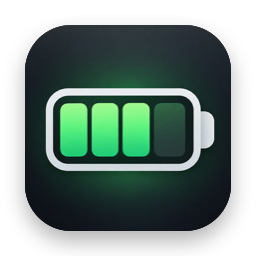
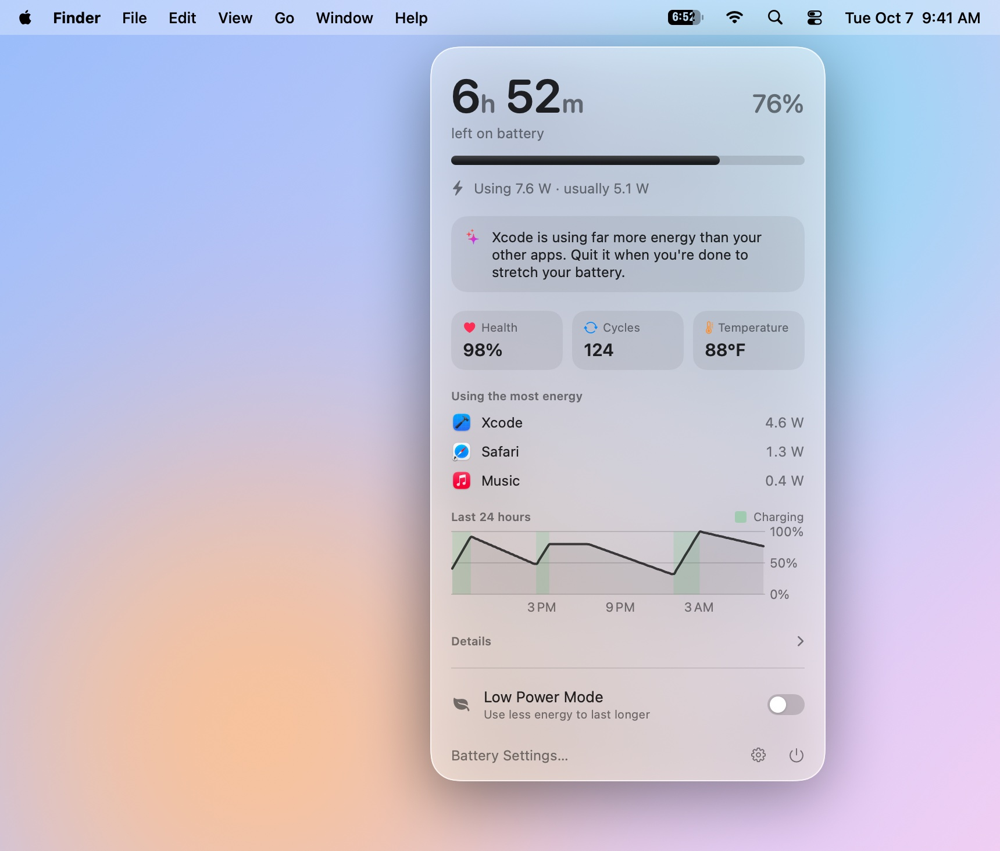
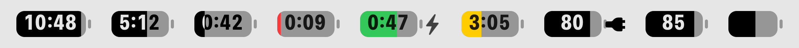

<p align="center">
  
</p>

<h1 align="center">Battery Strip</h1>

<p align="center">
  <strong>Free, open-source battery time remaining for your Mac's menu bar.</strong><br>
  See how long your MacBook battery will last, plus battery health, cycle count, temperature and the apps draining it, in one Liquid Glass panel.
</p>

<p align="center">
  <a href="https://github.com/vilanobeachflorida/battery-strip/releases/latest/download/Battery-Strip.dmg"><strong>Download Battery Strip</strong></a>
  &nbsp;·&nbsp; Free &nbsp;·&nbsp; macOS 26 Tahoe or later &nbsp;·&nbsp; Apple silicon (M1 and later)
</p>

<p align="center">
  
  
  
  
  <a href="LICENSE"></a>
</p>

<p align="center">
  <picture>
    <source media="(prefers-color-scheme: dark)" srcset="Design/Screenshots/panel-dark.jpg">
    
  </picture>
</p>

## Why Battery Strip?

Apple took the time remaining estimate out of the Mac's battery menu years ago, and the apps that bring it back usually cost money. Knowing how long your battery will last shouldn't be a paid feature, so Battery Strip is free and open source.

It replaces the battery icon in your menu bar with one that shows the time you have left, right inside the battery. One click opens everything else you'd want to know about your MacBook's battery.

## Features

### Battery time remaining in the menu bar

The menu bar battery reads `4:32` instead of a bare icon, so you always know how long your Mac will last. While charging, it shows the time until full, turns green and adds a bolt. It turns yellow in Low Power Mode and red when the battery is nearly empty. Prefer the battery percentage? Switch it in Settings.

<p align="center">
  <picture>
    <source media="(prefers-color-scheme: dark)" srcset="Design/Screenshots/menu-bar-states-dark.png">
    
  </picture>
</p>

### A time remaining estimate that doesn't jump around

macOS gives several different battery estimates at once, and they swing with every spike in usage. Battery Strip follows the last ten minutes of real power use, ignores brief spikes and dips, and only changes the number when your usage really changes. Time until full knows charging slows down after 80%, and it learns how long your own battery takes for that last stretch.

### MacBook battery health, cycle count, temperature and age

- **Battery health**, the same "Maximum Capacity" figure System Settings shows, with the exact capacity in mAh
- **Cycle count**, compared with the 1,000 cycles Apple rates Mac batteries for
- **Battery temperature**
- **When the battery was manufactured** and how old it is, on Macs that report it
- Voltage, current, charger wattage and power drawn from the adapter

### See which apps are draining your battery

A live list of the apps using the most energy over the last few minutes, with helper processes counted toward their app, so a busy browser tab shows up as the browser.

### Low Power Mode in one click

Turn Low Power Mode on or off right from the panel, without digging through System Settings.

### Smart battery suggestions with Apple Intelligence

When something stands out, like one app using far more energy than everything else or a low battery with Low Power Mode off, Battery Strip suggests what to do. With Apple Intelligence turned on, the suggestion is written on your Mac by the on-device model. Nothing is sent anywhere.

### Battery history and notifications

- A 24-hour battery history chart, with charging periods marked
- Optional notifications for low battery, a reminder to unplug at a level you choose (80% by default), and fully charged
- A note in the panel when a new version of Battery Strip is out

### Built for Liquid Glass and macOS Tahoe

A native SwiftUI and AppKit app designed for macOS 26's Liquid Glass. It reads the battery only when macOS reports a change, about once a minute, so it uses about 20 MB of memory and effectively no CPU when idle.

## Download and install

1. [Download `Battery-Strip.dmg`](https://github.com/vilanobeachflorida/battery-strip/releases/latest/download/Battery-Strip.dmg) and open it.
2. Drag **Battery Strip** into **Applications**, then open it from there.
3. The first time, macOS says it can't verify the app, because it isn't notarized by Apple. Click **Done**, open **System Settings › Privacy & Security**, scroll down, click **Open Anyway** next to Battery Strip, and confirm.

A short welcome guide then shows you where Battery Strip lives, how to move it along the menu bar (hold **⌘ Command** and drag), how to hide Apple's own battery icon, and turns on opening at login.

If you open Battery Strip from the disk image or your Downloads folder, it offers to move itself into Applications.

Every version, with what changed, is on the [Releases page](https://github.com/vilanobeachflorida/battery-strip/releases).

## FAQ

### How do I show battery time remaining on my Mac?

macOS no longer shows how long your battery will last in the menu bar. Install Battery Strip and the time remaining appears inside the battery icon, updated as your usage changes.

### How do I check my MacBook battery health and cycle count?

Click Battery Strip in the menu bar. Battery health and cycle count are right in the panel, and **Details** shows the battery's full charge capacity in mAh, its capacity when new, and when it was manufactured.

### Is Battery Strip really free?

Yes. Battery Strip is completely free and open source under the GPL-3.0 license, with no ads, subscriptions or in-app purchases.

### Does Battery Strip drain my battery?

No. It doesn't poll: it reads the battery only when macOS reports a change, about once a minute, and does almost nothing in between. It uses about 20 MB of memory, and checking for updates is one small request twice a week.

### Why does macOS say Battery Strip can't be verified?

Apple only skips that warning for apps signed with a paid Apple developer certificate and notarized by Apple. Battery Strip isn't yet, so macOS asks you to approve it once in **System Settings › Privacy & Security** with **Open Anyway**.

### How do I update Battery Strip?

Battery Strip checks for a new version twice a week and shows a note at the top of its panel when one is out. Click **Download**, open the disk image and drag Battery Strip into **Applications** to replace the old copy, then approve it with **Open Anyway** as you did the first time.

Now and then an update also brings a new version of the Low Power Mode helper. Battery Strip sets it up the next time you use the switch, and macOS remembers that you allowed Battery Strip, so there's normally nothing to approve.

### Which Macs does Battery Strip support?

MacBooks with Apple silicon (M1 and later) running macOS 26 Tahoe or later.

### How do I hide Apple's battery icon?

Open **System Settings › Menu Bar** and, under **Menu Bar Controls**, turn off **Battery**. Battery Strip's welcome guide takes you there and ticks the step off once it's done.

### Why does the Low Power Mode switch need approval?

macOS only lets system-level tools change power settings, so Battery Strip includes a tiny helper that does exactly one thing: switch Low Power Mode on or off. The first time you use the switch, Battery Strip explains this, then you approve the helper in System Settings. You can remove it any time in Battery Strip's Settings.

### Does Battery Strip collect any data?

No. Everything stays on your Mac. The only time Battery Strip goes online is to ask GitHub whether there's a new version, twice a week, and you can turn that off in Settings. Suggestions are written by the on-device model.

## Uninstall

1. If you set up the Low Power Mode helper, open Battery Strip's **Settings** and click **Remove Helper**. The helper lives inside the app, so it goes when the app does, but this is tidier.
2. Quit Battery Strip with the power button at the bottom of its panel.
3. Drag **Battery Strip** from **Applications** to the Trash.
4. To bring Apple's battery icon back, turn **Battery** on again in **System Settings › Menu Bar**.

Battery history is kept in `~/Library/Application Support/Battery Strip`, which you can delete too.

## Build from source

You need Xcode 26 or later.

```bash
scripts/run.sh             # build, install to /Applications and launch
scripts/release.sh         # build the disk image in build/release
scripts/rename-helper.sh   # give the Low Power Mode helper a new name, when release.sh asks
```

To publish a version, attach `build/release/Battery-Strip.dmg` to a GitHub release tagged with its version, such as `v1.0`. The download link above and the app's update check both use the latest release.

The Low Power Mode helper builds byte for byte the same every time, because macOS approves an ad hoc signed helper as one exact file. When its code changes, or a new Xcode compiles it differently, `scripts/release.sh` stops and asks you to run `scripts/rename-helper.sh`. The new name makes macOS treat it as a new helper, which Battery Strip sets up the next time someone uses the switch.

To ship a build that opens without the verification warning, sign it with a Developer ID and have Apple notarize it. With the certificate in your keychain and a `notarytool` profile saved:

```bash
DEVELOPER_ID="Developer ID Application: Your Name (TEAMID)" NOTARY_PROFILE=battery-strip scripts/release.sh
```

The app icon is generated from `Design/AppIcon.png` with `swift scripts/make-icon.swift`, and the disk image background with `swift scripts/make-dmg-background.swift`.

| Folder | What's in it |
|---|---|
| `BatteryStrip/App` | Startup, preferences, windows, opening at login, moving into Applications and checking for updates |
| `BatteryStrip/Battery` | Reading the battery, the time remaining estimator, history, app energy, suggestions and notifications |
| `BatteryStrip/MenuBar` | The menu bar battery, the glass panel and detecting Apple's battery icon |
| `BatteryStrip/Panel` | The panel's SwiftUI views |
| `BatteryStrip/Onboarding` | The welcome guide |
| `BatteryStrip/Settings` | The Settings window |
| `BatteryStrip/LowPower` | Switching Low Power Mode through the helper |
| `BatteryStrip/Support` | Reading battery temperature and manufacture date from the SMC |
| `BatteryStrip/Debug` | Debug-only tools: panel snapshots, README screenshots and diagnostics |
| `BatteryStripHelper` | The Low Power Mode helper |
| `Shared` | The helper's interface, used by both targets |
| `LaunchDaemons` | The helper's launchd definition, and which helper was last released |
| `Design` | The app icon, disk image background and screenshots |
| `scripts` | Building, releasing, renaming the helper and generating artwork |

## License

Copyright © 2026 vilanobeachflorida

Battery Strip is free software, released under the [GNU General Public License v3.0](LICENSE). You're free to use, study, share and change it. If you distribute it or a modified version, it has to stay under the same license, with its source code available.
